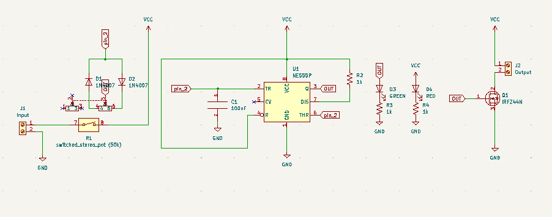
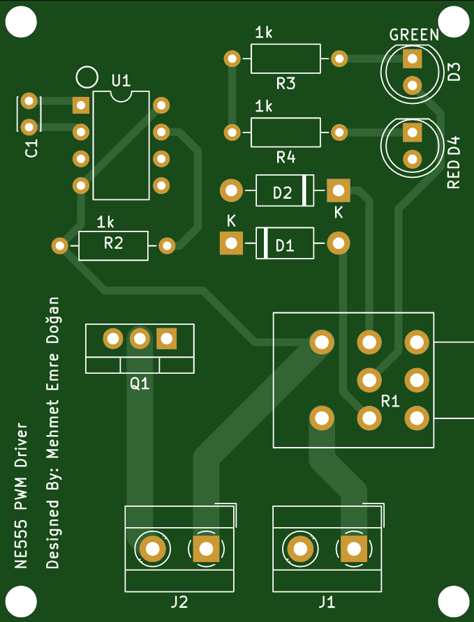
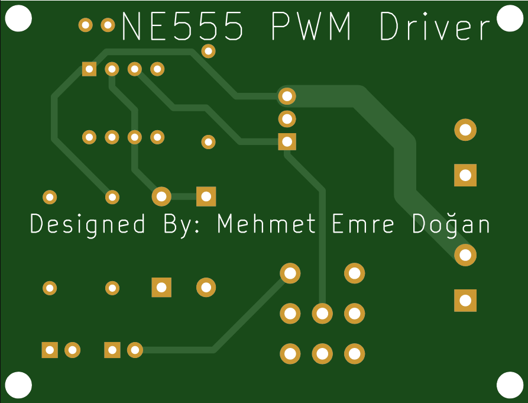
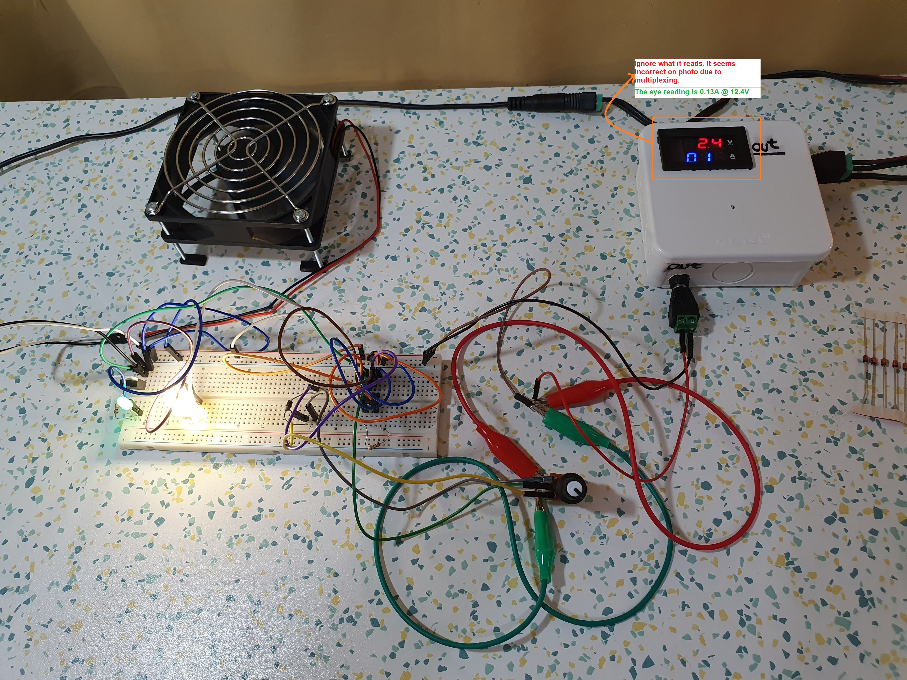

# NE555_PWM_Driver
NE555 precision timer based IRFZ44N LED/motor driver design.
 
## PCB Design (DIP)

 
### Schematic
 

 
 
### Front
 

 

### Back
 

 
 

## PCB Design (SMD)

 
### Schematic
 

 
 
### Front
 

 

### Back
 

 
 

 
 

 ## Prototype on Breadboard
  
 

 
 ### [Watch the video](https://youtu.be/RiIcqe25NVU)
 

 
 

 ## References
https://circuitdigest.com/electronic-circuits/555-timer-pwm-generator-circuit
