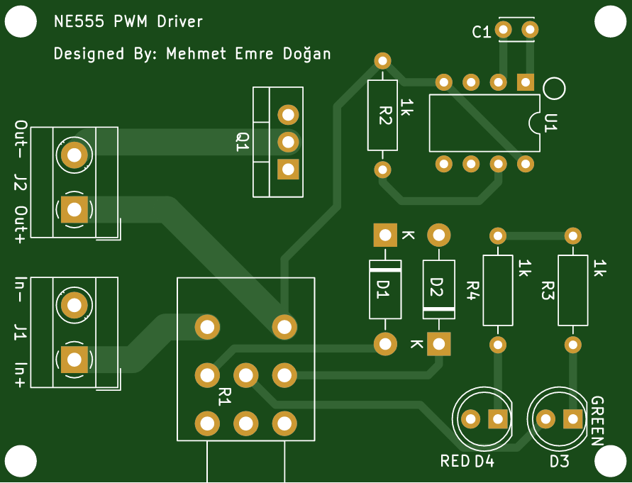
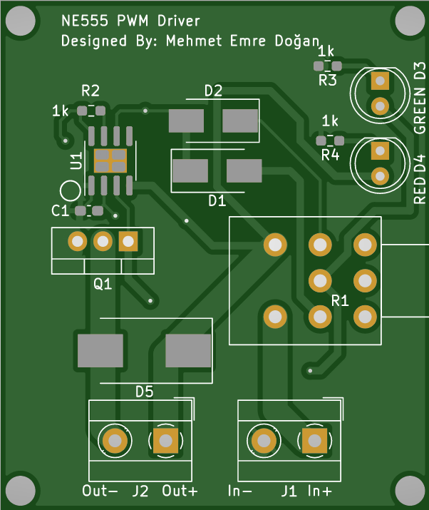
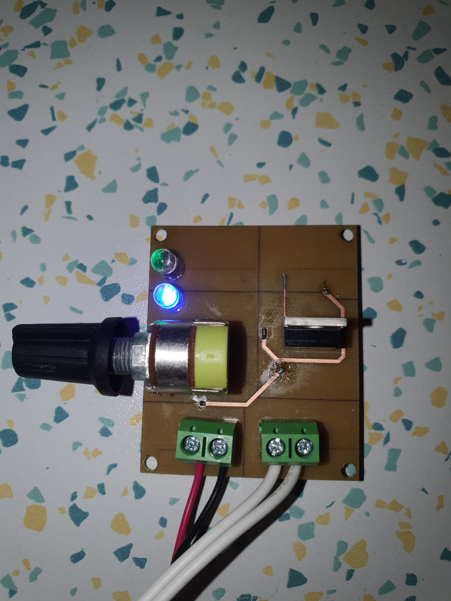

# NE555_PWM_Driver
NE555 precision timer based IRFZ44N LED/motor driver design.
- No feedback loop
- Just open loop control
- No filter
- Bare PWM output
 
## PCB Design (DIP)

 
### Schematic
 

 
 
### Front
 

 

### Back
 

 
 

## PCB Design (SMD)

 
### Schematic
 

 
 
### Front
 

 

### Back
 

 
 

## PCB Images (SMD)

 
### With Lamp
 

 
 
### Front
 

 

### Back
 

 
 

## Oscilloscope Waveforms

### General

### Whole Swing

### Ripple

### Noise

 

 ### Conclusion

 - The theoratical frequency is consistent with experimental frequency
 - There is small discrepancies between the theoratical ripple and experimental ripple

## Simulation on LTSpice
  
 

 
### Circuit
 

 

### Waveforms
 

 
 

 
 ## Prototype on Breadboard
  
 

 
 ### [Watch the video](https://youtu.be/RiIcqe25NVU)
 

 
 

 ## References
https://circuitdigest.com/electronic-circuits/555-timer-pwm-generator-circuit
